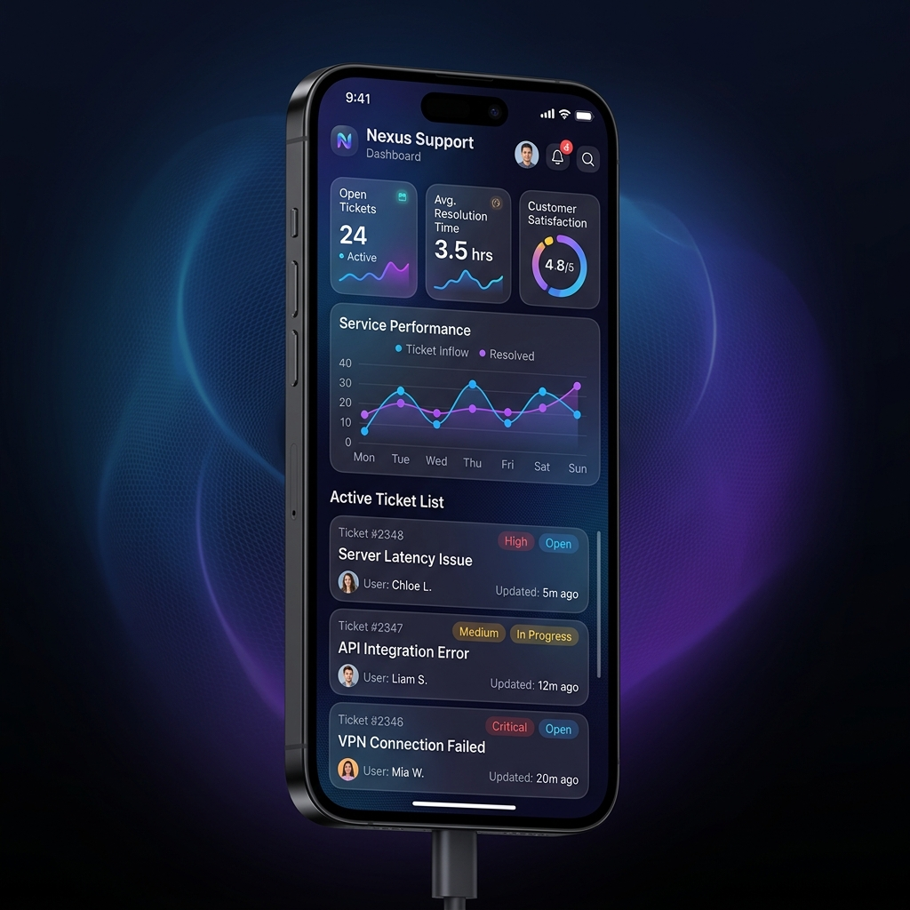

# 🛠️ App Controle de Chamados Técnicos



Uma solução moderna e elegante para gestão de suporte técnico, desenvolvida com **Ionic** e **Angular**. O aplicativo oferece uma interface premium focada na experiência do usuário, utilizando conceitos de **Glassmorphism** e **Dark Mode**.

## ✨ Funcionalidades Principais

- **📊 Dashboard de Resumo**: Visualize rapidamente o status geral dos chamados (Abertos, Em Atendimento, Concluídos).
- **📝 Gestão de Chamados**:
  - Cadastro de novos chamados com detalhes do cliente e equipamento.
  - Listagem completa com filtros visuais.
  - Atualização de status e adição de observações técnicas.
  - Detalhes detalhados de cada ocorrência.
- **👨‍🔧 Gestão de Técnicos**:
  - Cadastro de profissionais da equipe.
  - Listagem e organização de técnicos ativos.
- **🔒 Sistema de Login**: Interface de acesso segura e estilizada.
- **📱 Design Premium**: 
  - Interface Dark Mode nativa.
  - Efeitos de desfoque (Glassmorphism).
  - Gradientes dinâmicos (Mesh Gradients).
  - Navegação intuitiva via Menu Lateral.

## 🚀 Tecnologias Utilizadas

- [Ionic Framework v8+](https://ionicframework.com/)
- [Angular v20+](https://angular.io/)
- [TypeScript](https://www.typescriptlang.org/)
- [Sass (SCSS)](https://sass-lang.com/)
- [Capacitor](https://capacitorjs.com/) (para builds nativos Android/iOS)

## 📦 Como Instalar e Rodar

### Pré-requisitos
- Node.js instalado
- Ionic CLI instalado (`npm install -g @ionic/cli`)

### Passos
1. Clone o repositório:
   ```bash
   git clone git@github.com:paulinhoxdd2-debug/app-controle-chamados.git
   ```
2. Entre na pasta:
   ```bash
   cd app-controle-chamados
   ```
3. Instale as dependências:
   ```bash
   npm install
   ```
4. Inicie o servidor de desenvolvimento:
   ```bash
   ionic serve
   ```

## 🛠️ Estrutura do Projeto

- `src/app/pages`: Contém todas as telas do aplicativo.
- `src/app/services`: Lógica de negócios e persistência de dados (DataService).
- `src/assets`: Imagens e ícones.
- `src/theme`: Variáveis globais de estilo e definição do tema dark.

---
Desenvolvido por **claretiano** com foco em alta performance e design excepcional.
